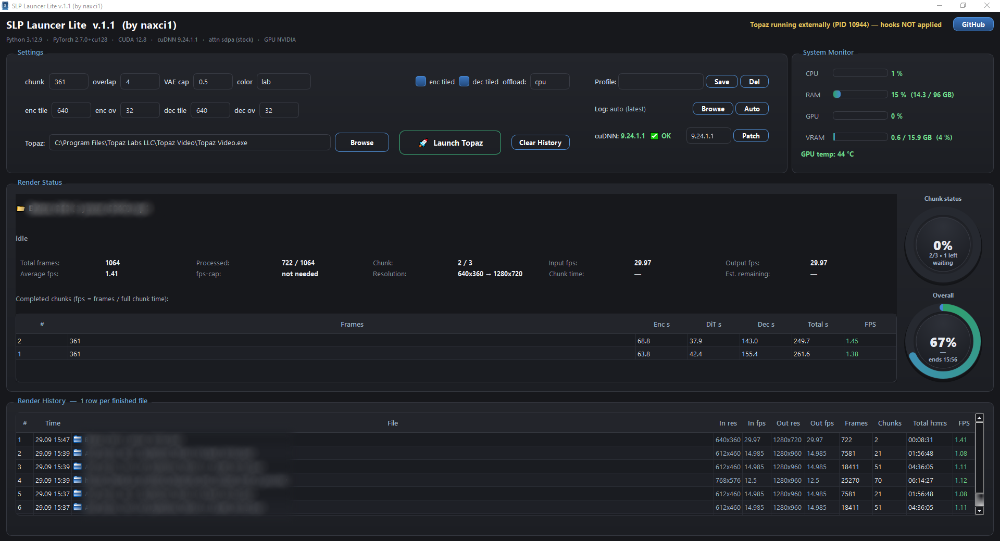

# SLP Launcher Lite

**A compact, 3D-styled companion launcher & live monitor for Topaz Video AI's SLP (Starlight Precision) model — Windows, installed app with built-in auto-update.**

> ### 🌟 Launch → Monitor → Done
> Simple, clean UI with a 3D design and zero-configuration defaults:
> press **Launch**, watch the live render monitor, collect finished files from the history.

---

## Table of contents

1. [What it does](#what-it-does)
2. [Features](#features)
3. [Requirements](#requirements)
4. [Download & install](#download--install)
5. [Quick start](#quick-start)
6. [The UI tour](#the-ui-tour)
7. [Settings explained](#settings-explained)
8. [cuDNN check & patcher](#cudnn-check--patcher)
9. [Log analyzer (external tzlog)](#log-analyzer-external-tzlog)
10. [Profiles](#profiles)
11. [Render history](#render-history)
12. [How it works (technical)](#how-it-works-technical)
13. [Troubleshooting](#troubleshooting)
14. [FAQ](#faq)
15. [Feedback & issues](#feedback--issues)

---

## What it does

Topaz Video AI ships the **SLP-2.5 / SLP-2.6 (Starlight Precision)** video-restoration model. Out of the box, the model runs with conservative memory settings that are not optimal for every GPU. SLP Launcher Lite:

- **launches Topaz Video AI with tuned, process-local overrides** (temporal chunk size, VAE tiling, LAB color transfer, memory caps), so the model renders faster on 16 GB-class GPUs **without touching any Topaz installation file**;
- **live-monitors every render** directly from Topaz's own log: current file, phase (VAE Encode → DiT Upscale → VAE Decode), chunk table, ETA, dual 3D progress rings;
- **records a permanent history** of finished files (frames, chunks, total time, average fps) — click any row to open its folder;
- **checks and patches the cuDNN library** inside Topaz's bundled PyTorch, from a SHA-256-verified official source.

All of this in a compact app with a dark 3D-styled interface — a standard Windows installer that keeps itself up to date.

## Features

| Area | Highlights |
|---|---|
| Launcher | One-click start of Topaz with overrides active; refuses to double-launch |
| Live monitor | File, phase, frames done/total, chunk counter, input/output fps, resolution, chunk time, ETA |
| Progress | Two circular 3D rings — per-chunk progress and overall progress with "ends HH:MM" estimate |
| Chunk table | Encode / DiT / Decode / total seconds and fps for each finished chunk |
| History | One row per finished file, `hh:mm:ss` total time, folder-open on click |
| Log analyzer | Open ANY Topaz `.tzlog` and replay its analysis (read-only) |
| Profiles | Save / load / delete named setting profiles |
| cuDNN | Version check (green/red), two patch targets, verified download, safe swap with backup |
| System monitor | CPU / RAM / GPU / VRAM bars + GPU temperature |
| Auto-update | Built-in version check (automatic on start + **Check** button); when a new release is out the button turns red **Update!** — one click downloads and installs it silently |
| Send Logs | One-click diagnostics: zips the active log, process list, system & GPU info, Windows event-log entries and settings, and e-mails the package to the developer |
| Install & data | Standard installer (Program Files, desktop & Start Menu shortcuts, clean uninstall); your data lives in `SLP_Lite_Data\` next to the app |

## Requirements

- **Windows 10 / 11 x64**
- **[Topaz Video AI](https://www.topazlabs.com/topaz-video-ai)** installed, with the **SLP (Starlight Precision) model** downloaded
- An **NVIDIA GPU** (the overrides and the cuDNN patcher target CUDA/NVIDIA setups; ~8–16 GB VRAM class is where tuning matters most)
- No Python needed — everything is bundled in the app

## Download & install

1. Download the latest installer from the [**Releases**](https://github.com/naxci1/SLP-Launcher-Lite/releases) page — direct link: **[SLP_Lite_Setup_v1.6.0.exe](https://github.com/naxci1/SLP-Launcher-Lite/releases/download/v1.6.0/SLP_Lite_Setup_v1.6.0.exe)**.
2. Run it — a standard wizard installs the app to Program Files and creates desktop & Start Menu shortcuts.
3. Done. Future updates arrive **in-app**: the header button turns red **Update!** when a new release is published — one click installs it silently, no manual re-download.

Your settings, profiles and history live in a `SLP_Lite_Data\` folder next to the app; if the install folder is read-only, the app automatically uses `%LOCALAPPDATA%\SLP Launcher Lite` instead. Uninstall any time from Windows **Apps & features**.

> ⚠️ Some antivirus products flag PyInstaller-packed EXEs generically. The binary contains only Python, PySide6 (Qt) and psutil — if your AV complains, add an exclusion for the EXE.

## Quick start

1. Start SLP Launcher Lite (desktop shortcut; opens maximized).
2. **Topaz path** is auto-detected from the registry; if the field is empty, browse to `Topaz Video.exe`.
3. Press **🚀 Launch Topaz**. The status line turns green: *"Topaz running — hooks active"*.
4. Inside Topaz, add videos to the queue and export with the **SLP / Starlight Precision** model as usual.
5. Watch the **Render Status** panel — per-chunk phases, ETA and history appear automatically as renders finish.

> **Important:** always launch Topaz **from SLP Lite**. A Topaz that was started directly does **not** get the tuned overrides — Lite will warn you if it detects such an instance.

## The UI tour

*Left:* settings (pipeline parameters, VAE tiling, Topaz path & launch). *Right of settings:* profiles, log selector and the cuDNN panel. *Right edge:* system monitor. *Below:* live render status with dual 3D progress rings and the chunk table, then the render history.

- **Header** — app title, live Topaz status, the version-check / **Update!** button, and **GitHub** (opens this repository).
- **Version strip** — the *installed* stack (Python / PyTorch / CUDA / cuDNN) is read from your actual Topaz folder, plus the active attention mode.
- Clicking the **active file name** (Render Status) opens its folder in Explorer; the 📁 icon in history rows does the same.

## Settings explained

| Setting | Meaning | Default |
|---|---|---|
| `chunk` | Temporal pixel-chunk size (frames per model pass). Must satisfy 4n+1. Smaller = less VRAM, more overhead | 361 |
| `overlap` | Frames shared between consecutive chunks for seamless stitching | 4 |
| `VAE cap` | `SLP25_VAE_CONV_MAX_MEM` budget (GiB) for VAE convolutions | 0.5 |
| `color` | Color-transfer method between chunks: `wavelet`, `lab`, `wavelet_adaptive`, `hsv`, `adain`, `none` | lab |
| `enc tile / enc ov` | VAE encoder tile size & overlap (px) for tiled encoding | 640 / 32 |
| `dec tile / dec ov` | VAE decoder tile size & overlap (px) | 640 / 32 |
| `enc tiled / dec tiled` | Toggle VAE encode/decode tiling on/off. Off = single pass — only for very large VRAM | on / on |
| `offload` | `TENSOR_OFFLOAD_DEVICE`: **cpu** = park tensors in system RAM (recommended on 8–16 GB cards) · **gpu** = keep everything on the GPU. On **24 GB+ VRAM** cards you can try `gpu`; on 16 GB and below keep `cpu` — A/B testing on a 16 GB card showed `gpu` is **not faster** (up to 18% slower, higher OOM risk because the card is already near-full during renders) | cpu |

Fixed internals (A/B-tested, not exposed): causal slice 4, DiT window group 10, **attention = stock PyTorch SDPA**, full pool off.

## cuDNN check & patcher

Topaz bundles its own cuDNN inside `neuroserver\...\torch\lib\`. Lite shows the installed version in the Settings panel:

- **green `✅ OK`** — version starts with **9.24** (either 9.24.0.43 or 9.24.1.1);
- **red `❌ patch required`** — anything else.

**Patch** button:

1. Detects your Topaz runtime's CUDA generation and downloads the matching target wheel (**9.24.1.1** or **9.24.0.43**) from the official PyPI packages (`nvidia-cudnn-cu12` / `nvidia-cudnn-cu13`) — **~393 MB**, with live progress;
2. Verifies the file's **SHA-256** against the pinned hash (a corrupted or tampered download is discarded automatically);
3. Renames the current DLLs to `*.dll.bak` (first-original backup is never overwritten) and copies the new ones in, retrying through antivirus/Defender file locks;
4. Safety-checks that every `cublasLt64_XX.dll` the new package needs exists in your `torch\lib` — if not, the patch is aborted *before* anything is written, with a clear explanation;
5. Re-checks the installed version and flips the label to green.

**Revert** restores Topaz's original cuDNN from the `*.dll.bak` backups at any time (single UAC prompt when Topaz is in `C:\Program Files`).

Rules enforced for safety: Topaz must be **completely closed** before patching (locked DLLs are detected). If Topaz is installed under `C:\Program Files`, Windows shows **one UAC prompt** — accept it and the patch applies automatically (no need to relaunch as administrator). A cached wheel `cudnn-<version>.whl` in `SLP_Lite_Data\` is reused, so you can also patch offline.

## Log analyzer (external tzlog)

Topaz writes rotating `.tzlog` files (`.log` on Topaz 1.7.1+) to `%APPDATA%\Topaz Labs LLC\Topaz Video\logs\`. Normally Lite follows the newest one. Press **Browse** to open **any** tzlog (an old session, a copy from another machine) — the Render Status and History panels switch to *analysis view* (marked with a yellow "external log" banner) and show what happened in that log. Nothing is written to your history. **Auto** returns to live mode.

## Profiles

- **Save** — stores all current settings under a name you choose (`SLP_Lite_Data\profiles.json`);
- selecting a profile from the combo **applies** it instantly;
- **Del** — deletes the selected profile;
- the last-used state is always auto-persisted in `preset.json`, so a restart continues where you left off.

## Render history

One row per finished render: time, file, in/out resolution & fps, frames, chunks, total time as `hh:mm:ss`, and average fps. Click the 📁 icon to reveal the file in Explorer (if the file was moved, its folder opens instead). Rows are appended automatically the moment Topaz reports *"total processing time"* for a render — previews are excluded. **Clear History** wipes the table.

## How it works (technical)

SLP Lite does **not** modify Topaz Video AI on disk. When you press Launch, it starts `Topaz Video.exe` with:

- environment variables describing the tuned parameters, and
- a `PYTHONPATH` pointing at a bundled `sitecustomize.py`.

That module is process-local: it monkey-patches the SLP model's Python module at import time (chunk size, VAE tiling, color transfer, attention mode) and writes audit lines into the same log Topaz reads. When Topaz exits, nothing remains. The cuDNN patcher is the **only** feature that writes into the Topaz folder, and it always keeps `.bak` backups.

Requires no admin rights for launching/monitoring; only the optional cuDNN patch may need elevation.

## Troubleshooting

| Symptom | Fix |
|---|---|
| *"Topaz exited immediately!"* | Another Topaz instance was open — close it fully (tray included), then Launch again |
| *"Topaz is ALREADY running (started outside this launcher)"* | That instance has no tuned overrides. Close it and launch from SLP Lite |
| Overrides don't seem active | Check the header: versions come from the Topaz folder you pointed to; make sure you launched via 🚀 |
| Patch says *file locked* | Topaz is still running — close it, then Patch |
| Windows asks for administrator permission on Patch | Normal when Topaz is in `C:\Program Files` — accept the single UAC prompt; if you decline it, Patch is not applied |
| Patch says *ACCESS DENIED* after accepting UAC | Something is blocking the elevated copy — right-click `SLP_Lite.exe` → **Run as administrator**, then Patch |
| GPU/VRAM bars show `—` | `nvidia-smi` not available (driver issue) — monitoring only, rendering unaffected |
| Antivirus flags the EXE | PyInstaller false positive; add an exclusion |
| History row click opens the folder but no file selected | The file was moved/deleted after the render — Lite opens its folder instead |

## FAQ

**Does it change my Topaz license or model files?**
No. All tuning is per-process (environment + runtime patch). The cuDNN patch swaps only cuDNN DLLs and keeps backups.

**Does it speed up rendering?**
It applies memory-oriented chunk/tiling tuning that on 16 GB GPUs typically keeps the model in its fastest path (≈1.0–1.4 fps at 1280×960 vs lower when the stock config spills over). Results depend on GPU, resolution and source.

**Where is my data?**
In `SLP_Lite_Data\` next to the app (or `%LOCALAPPDATA%\SLP Launcher Lite` when the install folder is read-only): `preset.json`, `profiles.json`, `history.json`, cached wheels. Uninstalling removes the app; delete that folder too for a fully clean removal.

**Is there a Mac version?**
No — Windows only for now.

## Feedback & issues

If you find a bug, or have an idea, feature request or any feedback, please open an issue — it is the fastest way to reach the developer:

👉 **[github.com/naxci1/SLP-Launcher-Lite/issues](https://github.com/naxci1/SLP-Launcher-Lite/issues)**

When reporting a problem, please include:

- SLP Launcher Lite **version** (see the window title)
- Your **GPU** (model + VRAM) and **Topaz Video AI version**
- What you expected vs. what happened
- For render issues: press **Send logs** in any error dialog — the launcher e-mails a complete diagnostic package (active log, processes, system & GPU info, Windows event-log entries, settings) automatically.
- For render issues: the `.tzlog` file (in the app: **Log → Browse** to open it, then attach it to the issue)

